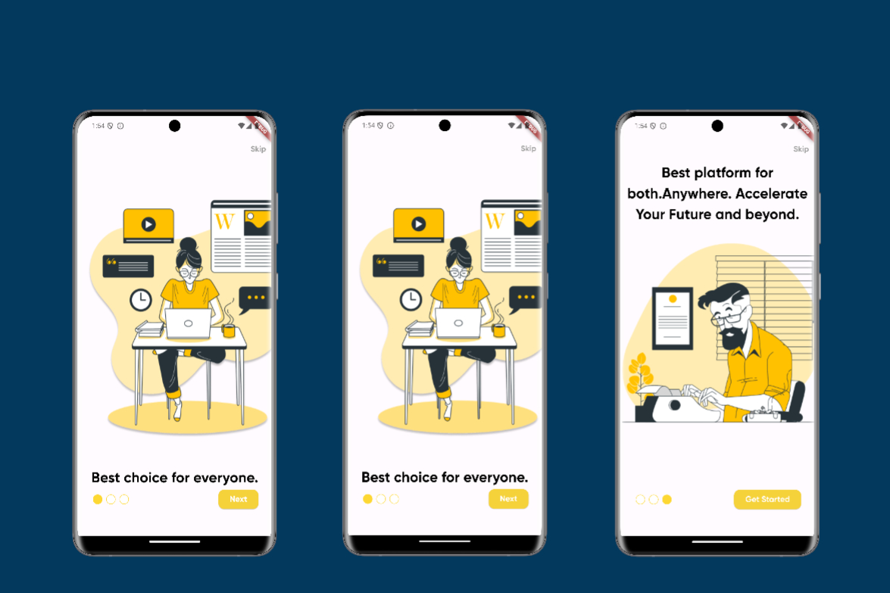

<!--
This README describes the package. If you publish this package to pub.dev,
this README's contents appear on the landing page for your package.

For information about how to write a good package README, see the guide for
[writing package pages](https://dart.dev/guides/libraries/writing-package-pages).

For general information about developing packages, see the Dart guide for
[creating packages](https://dart.dev/guides/libraries/create-library-packages)
and the Flutter guide for
[developing packages and plugins](https://flutter.dev/developing-packages).
-->

## Onboarding Screen

The Onboarding Screen is a Flutter package that provides a customizable onboarding experience for new users. It includes a series of pages with navigation controls and animations, designed to introduce users to the app's features in a user-friendly manner.

## Created by [@badiniibrahim](https://github.com/badiniibrahim)

Liked some of my work? Buy me a coffee. Thanks for your support :heart:

<a href="https://buymeacoffee.com/yourusername" target="_blank"></a>

## Screenshot

- IOS
  

- Android
  

## Features

- Horizontal page navigation with swipe gestures.
- Progress indicators to show the current onboarding page.
- "Next" and "Skip" buttons for user convenience.
- Animated transitions between pages.
- Built with GetX for efficient state management.

## Getting Started

Add the dependency to your `pubspec.yaml` file:

```yaml
dependencies:
  ...
  flutter_onboarding_screen_adaptive: latest_version
```

## Here's a complete example showcasing the usage of the Onboarding Screen:

```dart
void main() {
  runApp(MyApp());
}

class MyApp extends StatelessWidget {
  @override
  Widget build(BuildContext context) {
    return GetMaterialApp(
      home: OnboardingScreen(
        pages: [
          PageOne(),
          PageTwo(),
          PageThree(),
        ],
        onSkipSelected: () {
          // Handle skip action
        },
        onGetStarted: () {
          // Handle get started action
        },
        selectedColor: Colors.blue,
        unselectedColor: Colors.grey,
        indicatorSize: 20.0,
        skipText: "Skip",
        btnBackgroundColor: Colors.blue,
      ),
    );
  }
}

class PageOne extends StatelessWidget {
  const PageOne({super.key});

  @override
  Widget build(BuildContext context) {
    return Column(children: [
      Image.asset(
        "assets/images/1.png",
      ),
      const Center(
        child: Text(
          'Best choice for everyone.',
          style: TextStyle(
            fontSize: 30,
            color: Colors.black,
            fontFamily: 'Gilroy',
          ),
        ),
      )
    ]);
  }
}

class PageTwo extends StatelessWidget {
  const PageTwo({super.key});

  @override
  Widget build(BuildContext context) {
    return Column(children: [
      Image.asset(
        "assets/images/2.png",
      ),
      const Center(
        child: Text(
          textAlign: TextAlign.center,
          'Teachers & Learners',
          style: TextStyle(
            fontSize: 30,
            color: Colors.black,
            fontFamily: 'Gilroy',
          ),
        ),
      )
    ]);
  }
}

class PageThree extends StatelessWidget {
  const PageThree({super.key});

  @override
  Widget build(BuildContext context) {
    return Column(children: [
      const Center(
        child: Text(
          textAlign: TextAlign.center,
          'Best platform for both.Anywhere. Accelerate Your Future and beyond.',
          style: TextStyle(
            fontSize: 30,
            color: Colors.black,
            fontFamily: 'Gilroy',
          ),
        ),
      ),
      Image.asset(
        "assets/images/3.png",
      ),
    ]);
  }
}

```

### Figma link for example

- https://www.figma.com/design/J5yekPKDtYcAwU1z6ASFdX/E-learning-App-Onboarding-(Community)?node-id=1-15&t=Pv1ZRi6EscMIPG5U-0

### Parameters

- **`pages`**: (required) - A list of widgets representing the onboarding pages.
- **`selectedColor`**: The color of the selected page indicator. Default is Colors.blue.
- **`unselectedColor`**: Color - The color of the unselected page indicators. Default is Colors.grey.
- **`indicatorSize`**:double - The size of the page indicators. Default is 20.0.
- **`skipText`**:String - The text for the skip button. Default is "Skip".
- **`onSkipSelected`**: Function() - Callback when the skip button is pressed.
- **`btnBackgroundColor`**: Color - The background color of the navigation buttons. Default is Colors.blue.
- **`onGetStarted`**: Function() - Callback when the get started button is pressed.

## LinkedIn

Connect with me on [LinkedIn](https://www.linkedin.com/in/badini-ibrahim-sawadogo-306b119b/)
